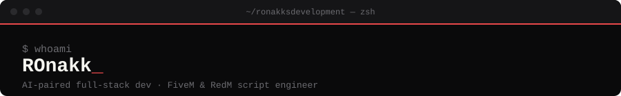

  

 

  <a href="https://ronakksdevelopment.github.io/portfolio/"><b>Portfolio</b></a> ·
  <a href="https://ronakksdevelopment.github.io/aurafarm/"><b>AuraFarm</b></a> ·
  <a href="https://github.com/ronakksdevelopment?tab=repositories"><b>Repositories</b></a> ·
  <a href="https://discord.gg/"><b>Discord</b></a>

 

### `$ whoami`

I build with LLMs as pair programmers rather than autocomplete — AI-paired development, some people call it vibe coding. I hold a BA in English Honors, which turned out to matter more for this work than I expected: prompting well is a writing problem before it's a coding one. That's the throughline across everything below — web apps, mobile interfaces, and FiveM/RedM game servers, moved through faster because the LLM is doing first-draft work while I do the architecture, review, and edit.

### `$ stack`

**AI workflow**

**Web & app**

**FiveM**

**RedM**

### `$ building`

**[Portfolio](https://ronakksdevelopment.github.io/portfolio/)** — custom-built showcase, developed through AI-paired workflows end to end.

**[AuraFarm](https://ronakksdevelopment.github.io/aurafarm/)** — platform and course initiative for sharing this workflow with other developers.

**FiveM / RedM scripting** — ongoing work on optimized scripts and logic-heavy systems for QBCore, ESX, Qbox, vRP, and VORP builds.

  
  

### `$ connect`

Open to freelance/contract work, technical co-founding, and FiveM/RedM server builds on custom frameworks.

  

  > *Most of my time on a project goes into the parts an LLM can't do for me — architecture, review, deciding what's actually worth building. The AI writes fast first drafts; the judgment is still mine.*

 

  <code>~/ronakksdevelopment</code>

